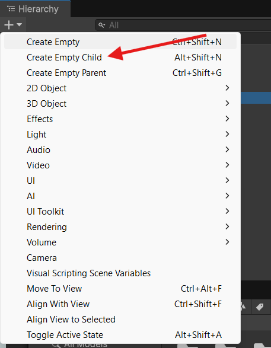

# Talka Sistema


**Zer da talka kontzeptu gisa Unityn?**

<mark style="background-color:purple;">Unity-n talkak objektuak elkarrekin fisikoki elkarreragiten dutenean gertatzen dira.</mark> Bi talka mota nagusi daude:

1. [**Collision**](talka-sistema.md#collision-talka-solidoa) - Objektuak elkar blokeatzen dutenean (solidoak)
2. [**Trigger**](talka-sistema.md#trigger-hautemate-gardena-mamua) - Objektuak elkar zeharkatzen dutenean detekzioa (gardenak)


<mark style="background-color:purple;">Objektu batek beste bat antzeman dezan, bi osagai izan behar ditu</mark> <mark style="background-color:purple;"></mark><mark style="background-color:purple;">**ezinbestean**</mark> <mark style="background-color:purple;"></mark><kbd><mark style="background-color:purple;">GameObject<mark style="background-color:purple;"></kbd> <mark style="background-color:purple;"></mark><mark style="background-color:purple;">orok</mark>: `Collider` eta <kbd>Rigibody</kbd>. Lehenak, objektuaren inguruan sare egiturazko estalki bat adierazten du du, gardena izatez. Geroz eta sare begi txikiagoak eta anitzagoak, orduan eta objektuaren formari egotiguagoa izango da. Zehaztasun mailak errealismoa emango dio edo faltsutu egingo du kontaktua. Inguruko sare estalki horien izena `Collider` da. Detekzioa hautemateko lehen osagaia dira.&#x20;




**Zer dira&#x20;**<kbd>**Collider**</kbd>**ak?**

`Collider`ak objektuen forma fisikoa definitzen duten osagaiak dira.&#x20;

* **Box Collider** - Kutxak, hormak, lurrak
* **Sphere Collider** - Pilotak, esferak
* **Capsule Collider** - Pertsonaiak, zilindro biribilduak
* **Mesh Collider** - Forma konplexuak (garestia GPU errendimenduan)




<figure><figcaption></figcaption></figure>



Detektatu edo hauteman nahi den objektu orok izan beharko duen beste osagaia <kbd>Rigibody</kbd> izenekoa da. Hau abstraktuagoa da azaltzen, arau eta ezaugarri multzo gisa irudikatzekoa:&#x20;


**Zer da&#x20;**<kbd>**Rigibody**</kbd>**?**

<kbd>Rigidbody</kbd> baitan daramaten objektuak (<kbd>GameObject</kbd> Unityn) arau fisikoak simlatzen dituen motorearen eraginpean daude. Hots, fisikak dituzte! <kbd>Rigidbody</kbd>k indarra eta bihurdura jaso ditzake bere objektuak modu errealistan mugi daitezen. `GameObject`ek `Rigidbody` izan behar dute grabitateak eragin diezaieten; edo, objektuaren baitan gordetako beste script (C# kode erantsia) bidez nahierako indarraren eraginpean jardun dezan; edo, beste objektu batzuekin elkarreragin dezaten NVIDIA Physx fisikako motorraren bidez.



Talka-detekzioak funtzionatzeko, gutxienez objektu batek <kbd>**Rigidbody**</kbd>izan behar du.

┌─────────────────┬──────────────┬──────────────┐\
│ │ Rigidbody │ Ez-Rigidbody │\
├─────────────────┼──────────────┼──────────────┤\
│ Rigidbody │ ✅ Talka │ ✅ Talka │\
│ Ez-Rigidbody │ ✅ Talka │ ❌ Ez │\
└─────────────────┴──────────────┴──────────────┘


## Collision vs Trigger



### Collision (Talka Solidoa)

* Objektuak **ez dira zeharkatzen**
* Fisika-indarrak aplikatzen dira
* Erabiltzen da objektu solidoetarako
* `OnCollisionEnter`, `OnCollisionStay`, `OnCollisionExit` funtzioak




```csharp
void OnCollisionEnter(Collision collision)
{
    Debug.Log("Talka honekin: " + collision.gameObject.name);
}
```








### Trigger (Hautemate gardena/mamua)

* Objektuak **zeharkatzen dira**
* Ez da fisika-indarrik aplikatzen
* Erabiltzen da detekzio-zonetarako
* `OnTriggerEnter`, `OnTriggerStay`, `OnTriggerExit` funtzioak
* Collider-ean **"Is Trigger"** aktibatuta egon behar du




```csharp
void OnTriggerEnter(Collider other)
{
    Debug.Log("Trigger-era sartu da: " + other.gameObject.name);
}
```






### Talkak hautematea



#### <kbd>Collision</kbd> funtzioaren bidez objektu ikuskorretan


```csharp
// Talka hasi denean (behin)
void OnCollisionEnter(Collision collision)
{
    Debug.Log("Talka hasi da");
}

// Talka mantentzen ari den bitartean (frame bakoitzean)
void OnCollisionStay(Collision collision)
{
    Debug.Log("Talka jarraitzen du");
}

// Talka amaitu denean (behin)
void OnCollisionExit(Collision collision)
{
    Debug.Log("Talka amaitu da");
}
```




#### <kbd>Trigger</kbd> funtzioaren bidez eremu gardenetan


```csharp
// Talka hasi denean (behin)
void OnCollisionEnter(Collision collision)
{
    Debug.Log("Talka hasi da");
}

// Talka mantentzen ari den bitartean (frame bakoitzean)
void OnCollisionStay(Collision collision)
{
    Debug.Log("Talka jarraitzen du");
}

// Talka amaitu denean (behin)
void OnCollisionExit(Collision collision)
{
    Debug.Log("Talka amaitu da");
}
```




### Talketatik informazioa eskuratzea

#### <kbd>Collision</kbd> objektuaren informazioa

```csharp
void OnCollisionEnter(Collision collision)
{
    // Talka egin duen objektua
    GameObject hitObject = collision.gameObject;
    
    // Objektuaren izena
    string name = collision.gameObject.name;
    
    // Talka puntuak
    ContactPoint contact = collision.contacts[0];
    Vector3 hitPoint = contact.point;
    Vector3 hitNormal = contact.normal;
    
    // Talka indarra
    float impactForce = collision.relativeVelocity.magnitude;
    
    // Tag egiaztatzea
    if (collision.gameObject.CompareTag("Player"))
    {
        Debug.Log("Jokalariak jo du!");
    }
}
```

#### <kbd>Trigger</kbd> objektuaren informazioa

```csharp
void OnTriggerEnter(Collider other)
{
    // Sartu den objektua
    GameObject enteredObject = other.gameObject;
    
    // Objektuaren izena
    string name = other.name;
    
    // Tag egiaztatzea
    if (other.CompareTag("Collectible"))
    {
        Debug.Log("Gauzatxo bat jaso da!");
        Destroy(other.gameObject);
    }
}
```

## Layer-based Collision (Kolisioen Geruzen Kontrola)

Unityn Layer-ak erabili ditzakezu zer objektu-motekin talka egin dezakeen kontrolatzeko.



### Layer-ak konfiguratzea

1. **Edit > Project Settings > Tags and Layers**
2. Gehitu Layer berriak: "Player", "Enemy", "Interactable", etab.
3. **Edit > Project Settings > Physics**
4. **Layer Collision Matrix** editatu





#### Kodean Layer egiaztatzea


```csharp
void OnCollisionEnter(Collision collision)
{
    // Layer-aren izenagatik
    if (collision.gameObject.layer == LayerMask.NameToLayer("Enemy"))
    {
        Debug.Log("Etsaia jo da!");
    }
}
```




<details>

<summary>ADIBIDE PRAKTIKOA</summary>

#### Palestra Interaktiboa

<figure><figcaption></figcaption></figure>

**Eszenatokia Konfiguratzea**

**1. Palestra (Plataforma)**

```
GameObject Hierarkia:
- Platform (GameObject)
  └─ Box Collider (ez-trigger)
```

**Ezarpenak:**

* Position: (0, 0, 0)
* Scale: (5, 0.2, 5)
* Box Collider: Normal collider
* Material: Edozein material (koloreduna)

**2. Objektu Interaktiboak**

Sortu hiru objektu:

Hodia (Zilindroa):

```
- Pipe (GameObject)
  └─ Capsule Collider
  └─ Rigidbody
```

Esfera:

```
- Sphere (GameObject)
  └─ Sphere Collider
  └─ Rigidbody
```

Kuboa:

```
- Cube (GameObject)
  └─ Box Collider
  └─ Rigidbody
```

**Ezarpen guztietarako:**

* Position: Palestratik goian (adib: Y = 3)
* Scale: (0.5, 0.5, 0.5)
* Rigidbody:
  * Mass: 1
  * Use Gravity: ✅ Aktibatuta
  * Is Kinematic: ❌ Desaktibatuta
* Tag:
  * Detektatze objektuak berdin tratatzeko etiketa berdina ezarri: `Interactable` deitu

<div><figure><figcaption></figcaption></figure> <figure><figcaption></figcaption></figure></div>

Eta azkenik Kuboari, Esferari eta Zilindroari esleitu etiketa berria. Kodean detektatzeko erabiliko da ondoren.

**3. Detekzio-zona (Trigger)**

Sortu trigger-zona bat palestran:

```
- DetectionZone (GameObject, palestratik haurra)
  └─ Box Collider (is Trigger ✅)
  └─ ObjectDetector.cs script
```

Honela egingo duzu:

<div><figure><figcaption></figcaption></figure> <figure><figcaption></figcaption></figure></div>

**Ezarpenak:**

* Position: (0, 0.6, 0) (palestratik pixka bat goian)
* Scale: (4, 1, 4)
* Box Collider:
  * Is Trigger: ✅ Aktibatuta
  * Size: (1, 1, 1)

**4. UI Panel-a (Canvas)**

```
- Canvas (World Space)
  └─ Panel
     └─ Text (TextMeshPro)
```

**Canvas Ezarpenak:**

* Render Mode: World Space
* Position: Ikuspegi onerako kokapena (adib: (0, 2, 3))
* Scale: (0.01, 0.01, 0.01)
* Width: 400, Height: 200

***


```csharp
using UnityEngine;
using TMPro; // TextMeshPro erabiltzeko

public class ObjectDetector : MonoBehaviour
{
    [Header("UI Erreferentziak")]
    [SerializeField] private TextMeshProUGUI detectionText;
    
    [Header("Detekzio Ezarpenak")]
    [SerializeField] private Color defaultColor = Color.white;
    [SerializeField] private Color detectionColor = Color.green;
    
    private int objectsInZone = 0;
    
    void Start()
    {
        // Ziurtatu TextMeshProUGUI aurkitu dela
        if (detectionText == null)
        {
            Debug.LogError("DetectionText ez da esleitu Inspector-ean!");
        }
        
        UpdateUI("Detekzio-zona: hutsik");
    }
    
    // Objektua trigger-era sartzean
    void OnTriggerEnter(Collider other)
    {
        // Soilik objektu interaktiboak detektatu
        if (IsInteractableObject(other))
        {
            objectsInZone++;
            
            // Objektuaren izena eta mota lortu
            string objectName = other.gameObject.name;
            string objectType = GetObjectType(other);
            
            // UI eguneratu
            string message = $"Detektatuta: {objectName}\nMota: {objectType}\nZonan: {objectsInZone} objektu";
            UpdateUI(message);
            
            // Kontsolan ere erakutsi
            Debug.Log($"✅ Objektua sartu da: {objectName} ({objectType})");
            
            // Aukerazko: Soinua jo edo efektua erakutsi
            PlayDetectionFeedback(other);
        }
    }
    
    // Objektua trigger-ean dagoen bitartean
    void OnTriggerStay(Collider other)
    {
        // Hemen detekzio jarraitu bat egin dezakezu behar izanez gero
        // Adibidez: denbora zenbatu edo efektu jarraituak
    }
    
    // Objektua trigger-etik irtetean
    void OnTriggerExit(Collider other)
    {
        if (IsInteractableObject(other))
        {
            objectsInZone--;
            
            string objectName = other.gameObject.name;
            
            // UI eguneratu
            if (objectsInZone > 0)
            {
                string message = $"Zonan: {objectsInZone} objektu";
                UpdateUI(message);
            }
            else
            {
                UpdateUI("Detekzio-zona: hutsik");
            }
            
            Debug.Log($"❌ Objektua irten da: {objectName}");
        }
    }
    
    // Objektua interaktagarria den egiaztatzea
    private bool IsInteractableObject(Collider other)
    {
        // Tag-aren bidez egiaztatu
        if (other.CompareTag("Interactable"))
        {
            return true;
        }
        
        // Edo izenagatik
        string name = other.gameObject.name.ToLower();
        return name.Contains("pipe") || 
               name.Contains("sphere") || 
               name.Contains("cube") ||
               name.Contains("hodi") ||
               name.Contains("esfera") ||
               name.Contains("kubo");
    }
    
    // Objektu mota identifikatzea
    private string GetObjectType(Collider other)
    {
        // Collider motaren arabera
        if (other is SphereCollider)
        {
            return "Esfera";
        }
        else if (other is BoxCollider)
        {
            return "Kubo";
        }
        else if (other is CapsuleCollider)
        {
            return "Hodi (Zilindro)";
        }
        
        // Edo izenaren arabera
        string name = other.gameObject.name.ToLower();
        if (name.Contains("sphere") || name.Contains("esfera"))
        {
            return "Esfera";
        }
        else if (name.Contains("cube") || name.Contains("kubo"))
        {
            return "Kubo";
        }
        else if (name.Contains("pipe") || name.Contains("hodi"))
        {
            return "Hodi";
        }
        
        return "Objektu Ezezaguna";
    }
    
    // UI testua eguneratzea
    private void UpdateUI(string message)
    {
        if (detectionText != null)
        {
            detectionText.text = message;
            
            // Kolorea aldatu objektuak badaude
            detectionText.color = objectsInZone > 0 ? detectionColor : defaultColor;
        }
    }
    
    // Feedback bisual edo soinuzkoa
    private void PlayDetectionFeedback(Collider other)
    {
        // Objektua pixka bat argitu
        Renderer renderer = other.GetComponent<Renderer>();
        if (renderer != null)
        {
            // Aukerazko: Aldatu materiala edo kolorea momentu batez
            // renderer.material.color = Color.yellow;
        }
        
        // Aukerazko: Soinua jo
        // AudioSource audio = GetComponent<AudioSource>();
        // if (audio != null) audio.Play();
    }
}
```


Alternatiba sinpleagotua:

```csharp
using UnityEngine;
using TMPro;

public class SimpleObjectDetector : MonoBehaviour
{
    [SerializeField] private TextMeshProUGUI displayText;
    
    void OnTriggerEnter(Collider other)
    {
        // Objektuaren izena erakutsi
        displayText.text = "Objektua: " + other.gameObject.name;
        Debug.Log("Detektatuta: " + other.name);
    }
    
    void OnTriggerExit(Collider other)
    {
        // Testua garbitu
        displayText.text = "Zona hutsik";
    }
}
```

</details>
