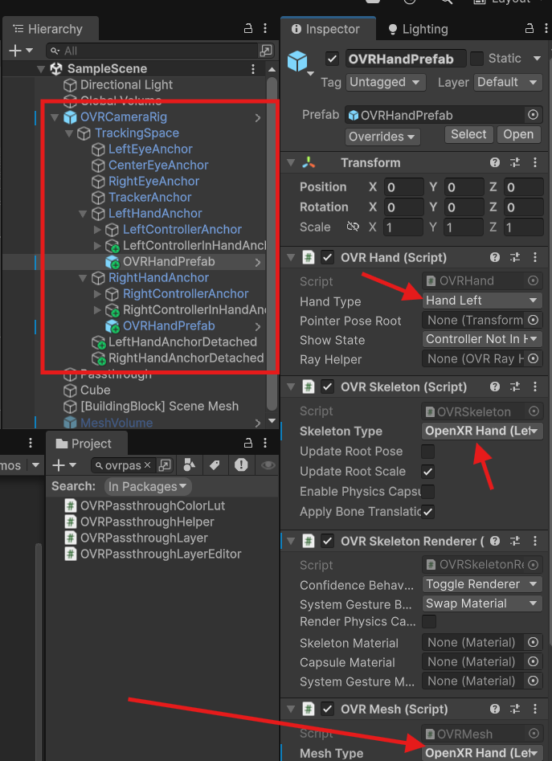

# VR Garapena

ADIBIDE PRAKTIKOA

## EM Kuboa

<kbd>Meta XR All-in-One Building Block</kbd>a erabiliko da Unityren 6 bertsioan. Ezertan hasi orduko XR pluginak instalatu: Open XR aktibatu (<kbd>Meta XR feature group</kbd> aukeratu) bai Windows zein Androiderako, eta, azken hau aktibatu Build Profile gisa.&#x20;

### 1. Oinarrizko Setup-a (Meta XR All-in-One SDK)

Kamera eta Passthrough eskuz konfiguratu daitezkeen edo bloke bat erabili  (`[BuildingBlock] Meta XR All-in-One` ). Lehena egingo dugu, eskuz.&#x20;

1. Eszena garbi batean (ezabatu `Main Camera` ).
2. Bilatu Project atalean <kbd>OVRCameraRig</kbd> prefaba (<kbd>in Packages</kbd> barruan) eta eraman eszenako errora.&#x20;
3. <kbd>OVRPassthroughLayer</kbd> bilatu Project ataleko paketeetan berriz ere eta eszenara eraman.&#x20;
4. Inspector-ean, ziurtatu Kameran ondoko ezarpenak aktibatuta daudela:&#x20;
   1. OVR Manager -> Quest 3 ✅
   2. Quest Features -> General -> Hand Tracking Support -> **Controllers And Hands**
   3. Quest Features -> General -> Hand Tracking Frequency -> **High**
   4. Quest Features -> General -> Scene Support -> **Required**
   5. Quest Features -> General -> Passthrough Support -> **Supported**

<figure><figcaption></figcaption></figure>

5. Kamera barruan LeftHandAnchor blokean gehitu Proiektutik arrastratuta <kbd>OVRHandPrefab</kbd> bana ezkerreko eskura. RightHandAnchorekin ere berdina egin. Batekin zein bestearekin moldatu ezarpenak esku bakoitzera:

### 2. Gela Kargatu (<kbd>Scene Mesh</kbd>)

All-in-One daukazun arren, gela kargatzeko blokea gehitu behar duzu.

1. Arrastatu Scene Mesh blokea eszenara (Building Blocks leihotik).
2. Play ematean gela ez bada agertzen, ziurtatu All-in-One barruko `OVRManager` ezarpenetan Scene Support aktibatuta dagoela (askotan All-in-One-k automatikoki egiten du, baina egiaztatzea ondo dago).

<figure><figcaption></figcaption></figure> <figure><figcaption></figcaption></figure> <figure><figcaption></figcaption></figure>

### 3. Oklusioa Konfiguratu (Hormen Atzean Ezkutatzea)

Hormak ikusezin bihurtuko ditugu, baina kuboa hormaren atzean badoa, desagertu egingo da (errealismoa).

1. Materiala Sortu: Project leihoan, eskuin klik > `Create > Material`. Deitu "_OcclusionMat_".
2. Shader-a Aldatu: Materiala aukeratuta, Inspector-ean `Shader` jartzen duen goiko menuan, bilatu eta aukeratu hauetako bat:
   * Aukera A (Gomendatua): `Meta > Universal > Occlusion` (URP erabiltzen baduzu).
   * Aukera B (Alternatiba): `Oculus > Unlit > Transparent` (eta jarri kolorearen Alpha/Gardentasuna 0-ra).
   * Aukera C (Azkarra): Bilatu proiektuan "MatteShadow" izeneko materiala existitzen den (Samples badituzu).
3. Prefab-a Editatu:
   * Aukera Hierarchy-an <kbd>Scene Mesh</kbd> objektua.
   * Inspector-ean, bilatu `Mesh Prefab` edo `Volume Prefab` aldagaia.
   * Egin klik aldagaian dagoen prefab-ean proiektuan non dagoen ikusteko.
   * Ireki prefab hori (klik bikoitza).
   * Arrastatu sortu duzun "OcclusionMat" materiala prefabaren gainera (urdina izateari utzi eta beltz/garden bihurtu behar da).
   * Gorde eta atera prefab-etik.

> Argazkia: _OcclusionMat materialaren ezarpenak eta Scene Mesh prefab-ari aplikatzen._

### 4. Kuboa Sortu eta Konfiguratu (Fisika)

Zati hau berdin mantentzen da, funtsezkoa baita zero grabitaterako.

1. Sortu: <kbd>GameObject > 3D Object > Cube</kbd>.
2. Gehitu osagaia: <kbd>Rigidbody</kbd>.
3. Konfigurazio zehatza Inspector-ean:
   * Mass: `0.01` (Arina).
   * Linear Damping: `0` (Frenorik ez).
   * Angular Damping: `0.05`.
   * Use Gravity: ⬜ DESMARKATU.
   * Is Kinematic: ⬜ DESMARKATU.
   * Collision Detection: Continuous Dynamic.
   * Constraints: Ziurtatu `Freeze Position` guztiak hutsik daudela.

<figure><figcaption></figcaption></figure>

### 5. Eskuak Aurkitu eta Prestatu (Garrantzitsua)

"OVRCameraRig" prefab bat denez, eskuak barruan "ezkutatuta" daude.&#x20;

1. Hierarchy-an, zabaldu <kbd>OVRCameraRig</kbd> objektuaren gezia.
2.  Jarraitu bide hau:

    TrackingSpace > LeftHandAnchor.
3. LeftHandAnchor aukeratuta, gehitu osagaiak Inspector-ean:
   * Sphere Collider (Radius: `0.05`).
   * Rigidbody:
     * Use Gravity: ⬜ Desmarkatu.
     * Is Kinematic: ✅ MARKATU.
     * Collision Detection: Continuous Dynamic.
4. Errepikatu `RightHandAnchor`-arekin (TrackingSpace barruan dagoena ere).

<figure><figcaption></figcaption></figure>

### 6. Material Fisikoa (Irristakorra)

Kuboa gainazaletan ez itsasteko.

1. Sortu Physic Material bat (Project leihoan) `ZeroFriction` izenarekin.
2. Ezarri balioak:
   * Friction (Dynamic/Static): `0`
   * Bounciness: `0.8`
   * Friction Combine: `Minimum`
   * Bounce Combine: `Maximum`
3. Arrastatu material hau Kuboaren <kbd>Box Collider</kbd>-era.

> Argazkia: _Physic Materialaren ezarpenak._

***


**Oharra:**

"All-in-One" erabiltzean, gogoratu beti TrackingSpace karpeta bilatu behar dela kameraren eta eskuen osagaiak aurkitzeko. Prefab bat denez, geruzaka antolatuta dago.


